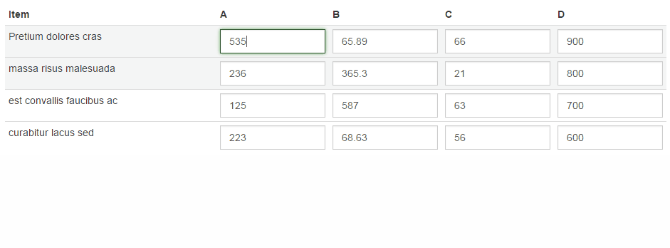

# Arrow Table

Navigate HTML tables with arrow keys.



## Usage

```javascript
$('#my-table').arrowTable();
```

## Examples

### Enabling only certain keys
```javascript
$('#my-table').arrowTable({
	enabledKeys: ['up', 'down']
});
```

### Using `beforeMove`

You can use this callback to decide whether to allow the move or not. If you return `false` the plugin will stop the move.

```javascript
$('#my-table').arrowTable({
	focusTarget: 'input, textarea',
	beforeMove: function(input, targetFinder, direction) {
		// Determine the target
		var target = targetFinder();
		if (direction === 'up' && $(target).is('textarea'))
		{
			// Don't allow move
			return false;
		}

		// Return nothing to allow the move
	}
});
```

It's even possible to modify the table in the `beforeMove` callback adding a row and the plugin will find the newly added row.

```javascript
$('#my-table').arrowTable({
	beforeMove: function(input, targetFinder, direction) {
		if (direction === 'down')
		{
			$(input).closest('table').find('tbody').append('<tr><td><input type="text"/></td></tr>');
		}
	}
});
```

See all possible options below.

## Options

Option          | Default                           | Description
----------------|-----------------------------------|--------------
enabledKeys     | `['left', 'right', 'up', 'down']` | Enabled keys
listenTarget    | `'input'`                         | Target to listen for key move events
focusTarget     | `'input'`                         | Target to focus after move
continuousDelay | `50`                              | Delay in ms before moving onto next cell when holding arrow keys down
beforeMove      | `$.noop`                          | Before moving callback. Return `false` to stop move
afterMove       | `$.noop`                          | After moving complete callback.

## API

### destroy
```javascript
$('#my-table').arrowTable('destroy');
```
Destroy the plugin instance